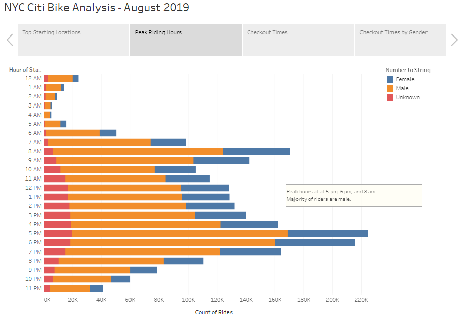
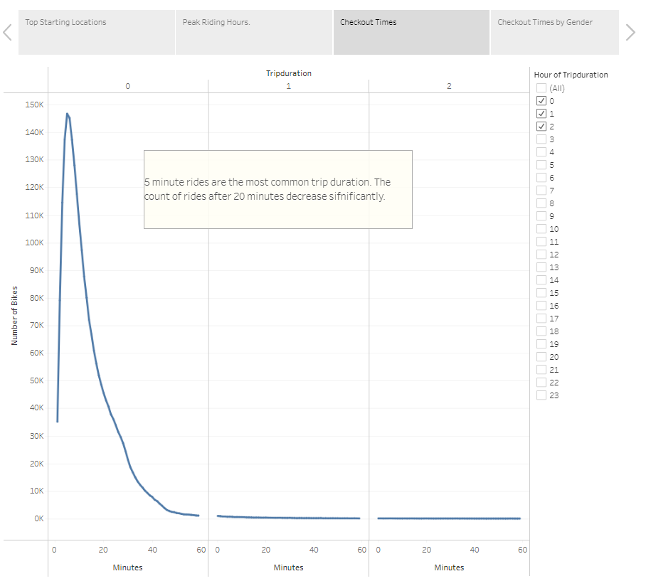
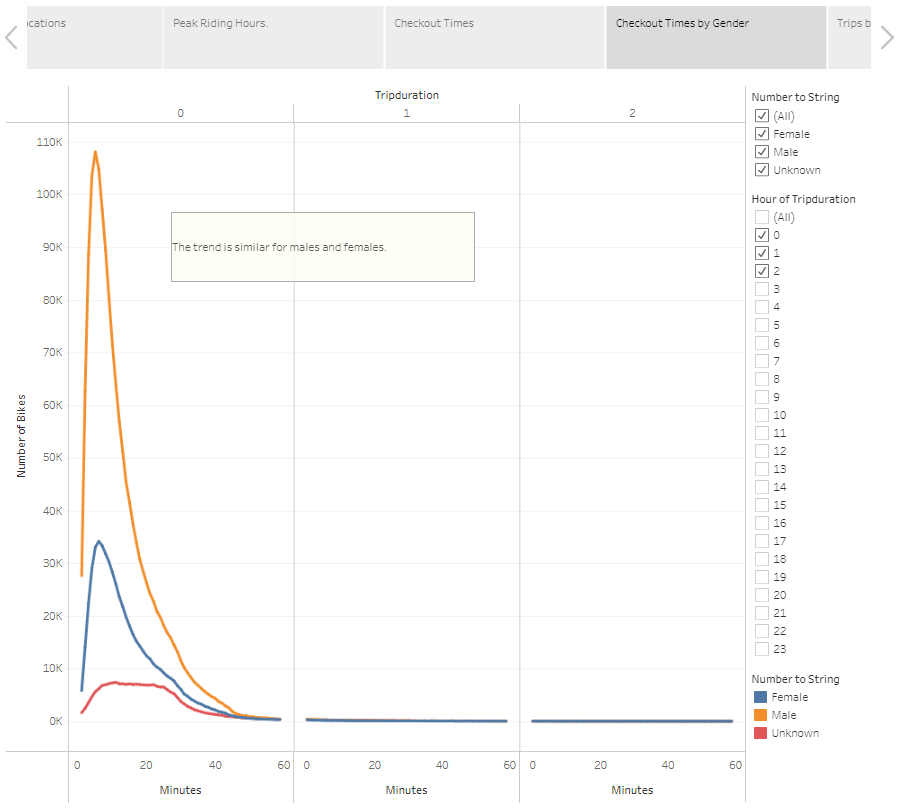
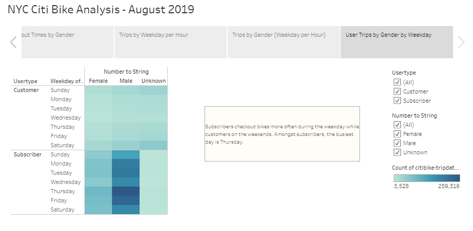

# NYC Citi Bike Analysis - August 2019

## Project Overview

### Purpose

The purpose of this project is to understand how the Citi bike sharing program works in New York City to explore the opportunity to start a similar bike share business in Des Moines, Iowa. 
To perform the analysis, we used August 2019 Citi bike riding data, and prepared a presentation to convince potential investors.
The link to the dashboard can be access by clicking [HERE.](https://public.tableau.com/app/profile/mariela.kinn.terrazas/viz/NYCCitiBikeAnalysis_16574104599600/Story1)

##  Results

The results of the analysis and visualizations are shown below:

First, we wanted to understand what are the most popular starting locations. The above picture indicates that the top starting locations are in Manhattan, with Pershing Square being the number one location.

The above picture shows that peak hours are 8 am, 5 pm, and 6 pm. This gives us an indication that many people are using the bikes to commute to and out of work.
In the graph we can also deduct that the majority of riders are men.

This photo shows that most people use the bikes for short trips. Most people's trip duration is between 3 - 15 minutes.

Once again, we can see that the majority of bike riders are men. However, the trend remains the same when it comes to trip duration.

In the above heat map, we confirm the most popular hours, which gives us an indication that bike-sharing is more often used by commuters rather than tourists.

We observe the same trend when we segregate male and females.

This last heat map shows that subscribers checkout bikes more often during the weekday while other customers check out bikes during the weekends. Amongst subscribers, the busiest day is Thursday, and the least busy day is Sunday.

## Summary

The main takeaways of this analysis are:
1. Many bike-sharing users are people who is commuting to and out of their jobs. For that reason, more than 80% of the total rides that occurred in August were from people who has a subscription. 
2. Data suggest that most people use the bike for 3 - 15 minutes. Knowing this information allows us to better set the pricing structure, and strategize where the bike stations should be located.
3. More males use the bike-sharing program than females. This is useful information for marketing campaigns.
4. There's higher utilization by subscribers during weekdays, and higher utilization by customers during the weekends

For future analysis I would look into Des Moines demographic and try to understand if there is truly a demand for a bike-sharing business. Surveys can be conducted as well as market research in which we could determine the number of people that would be interested in this program.  

